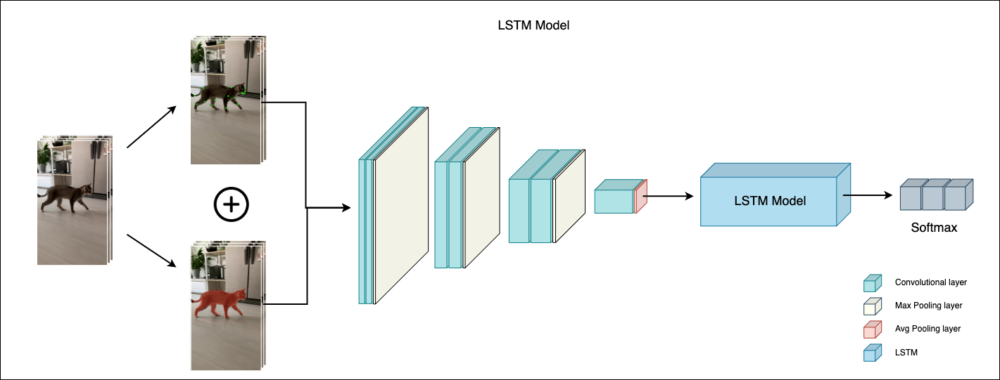
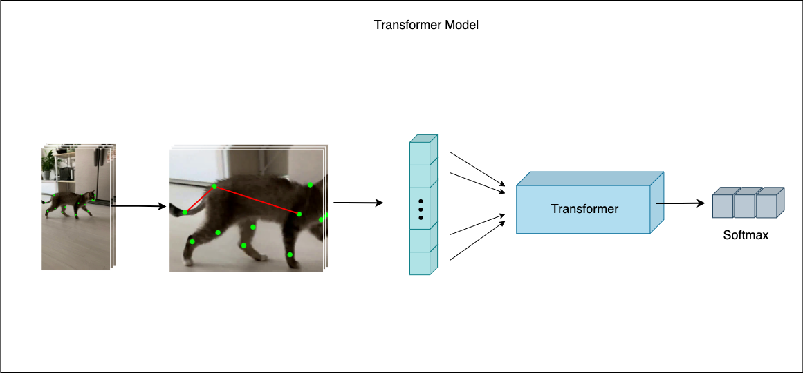

## Introduction

 

### Animal Action Recognition

    

                                            
Animal Behabior Classification with AAR Models 

## AAR NETs

### LSTM Model

    

### Transformer Model

    

## Third Party
We use Third party libraries

### yolact
Masking objects
[yolact](https://github.com/dbolya/yolact)

### mmpose
Getting Keypoints
[mmpose](https://github.com/open-mmlab/mmpose)

